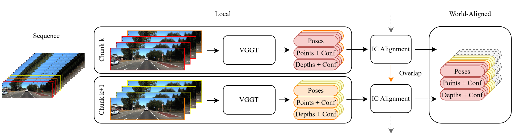
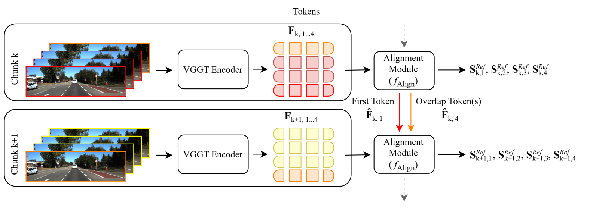

<div align="center">
<h1>Large-Scale-ViT-SLAM</h1>

</div>

## Overview

This project originates from a master's thesis at the Technical University of Munich. We present a SLAM (Simultaneous Localization and Mapping) pipeline that leverages the feed-forward reconstruction model <a href="https://github.com/facebookresearch/vggt">VGGT</a>. Our approach addresses the challenge of achieving efficient feature-level alignment in large-scale environments without solely relying on loop closure for drift mitigation. The pipeline processes image sequences into 3D outputs, including point maps, poses, and depths.

<p align="center"></p>
  <p align="center"><strong><em>Overview of a general chunk-and-align pipeline</em></strong></p>

To process arbitrary amounts of images and circumvent the GPU memory limitations inherent in VGGT, we adopt the chunk-and-align paradigm. An input image sequence of variable length is split into overlapping segments, called chunks, which are subsequently processed by VGGT. The chunks are aligned into a joint coordinate frame via optimization over correspondences between overlapping frames.

<p align="center"></p>
  <p align="center"><strong><em>Overview of our pipeline</em></strong></p>

Most concurrent work optimizes over VGGT’s decoded quantities, such as points or poses. In contrast, our approach computes inter-chunk alignment at the feature level, clearly setting our methodology apart. To achieve this, we introduce an alignment module. This module processes features from the VGGT encoder and produces per-frame similarity alignment. Subsequently, we apply this alignment to all VGGT decoder outputs to combine them in a single coordinate frame.

Additionally, other feed-forward SLAM variants typically employ global optimization or loop closure to ensure global consistency and prevent drift accumulation. As a second objective, we examine replacing dedicated loop closure with a feature-level memory mechanic within our alignment module. We maintain a compressed summary of all past chunks, constructed by extracting and retaining key features that capture each chunk's unique characteristics. This summary is then injected into the current chunk's features during processing. By augmenting the current chunk's features with the past information before decoding the similarity transform, we aim to improve alignment for longer sequences.

In kilometer-scale driving scenes, we observe better inter-chunk alignment with a translational RPE (Relative Pose Error) improvement of around 40% compared to optimization-based alignment on output quantities. However, drift still accumulates significantly, with a 70% worse ATE (Absolute Trajectory Error) compared to methods using explicit loop closure. Our results show that while feature-level alignment provides benefits, the memory mechanic ultimately does not replace loop closure.

## Installation

First, clone this repository to your local machine:

```bash
git clone https://github.com/ruppelb/Large-Scale-ViT-SLAM
cd Large-Scale-ViT-SLAM
```
Create and activate a new conda environment:
```bash
conda create -n ls-vit-slam python=3.10
conda activate ls-vit-slam
```
Before installing our project and VGGT as a package, install PyTorch, torchvision, and PyTorch3D compatible with your CUDA version:
```bash
# pytorch 2.5.1 with cuda 12.1
pip install torch==2.5.1 torchvision==0.20.1 --index-url https://download.pytorch.org/whl/cu121
pip install "git+https://github.com/facebookresearch/pytorch3d.git@stable"
```
Clone and install VGGT via pip:
```bash
git clone https://github.com/facebookresearch/vggt.git
pip install -e ./vggt
```
Details on the license for VGGT can be found [here](https://github.com/facebookresearch/vggt/blob/main/LICENSE.txt).

Install our project via pip:
```bash
pip install -e .
```

## Quick Start
### Datasets
Our model must be retrained on each dataset before inference. In our work, we focus on large-scale driving datasets, such as Virtual KITTI, KITTI Odometry, and Waymo Open, for which we also provide dataloaders.
Pretrained weights of our model on the Virtual KITTI dataset are available [here](https://drive.google.com/drive/folders/11hfo7EEjLmS-UKs-eGEH1H7ADCMubQzo?usp=sharing).

### Configurations
Within the `training/config` folder, you can find example configurations for inference on the Virtual KITTI dataset, indicated by the `test_` prefix. The point- and pose-aligned variants can be used to obtain results without feature alignment or pretraining, i.e., they represent the out-of-the-box performance achievable with VGGT and an output-based inter-chunk alignment. The feature-aligned version is our own model.

#### Required Path Configuration
Before running inference, you have to specify the dataset path and, if applicable, the checkpoint path in the configuration file for the respective variant. For this:

1. Open the configuration file of your choice, e.g., `training/config/test_featureAlignedVGGT_vkitti.yaml`
2. Update the following paths with your absolute directory paths:
   - `VKitti_DIR`: Path to the Virtual KITTI dataset
   - `model_checkpoint_path`: (Optional) Path to the checkpoint of the pre-trained feature-aligned variant 

#### Configuration Example

```yaml
data:
  test:
    dataset:
      dataset_configs:
        - _target_: datasets.vkitti.VKittiDataset
            split: train
            VKitti_DIR: /YOUR/PATH/TO/VKitti

checkpoint:
  model_checkpoint_path: /YOUR/PATH/TO/CKPT
```

### Inference
After adjusting the configuration, you can start the inference by executing:

```bash
python training/run_model.py --config test_featureAlignedVGGT_vkitti
```

### Evaluation
We provide implementations for the ATE and translational and rotational RPE metrics for evaluating tracking performance. Reconstruction performance is measured using the Chamfer distance, completion, and accuracy metrics. By default, all metrics are computed when doing an inference run with the test configurations, but this behaviour can be adjusted within the `metrics` section of the respective configuration files. All metric results are also saved to a file.

### Visualization
You can enable visualization of the reconstruction results via Viser by setting the `visualization` key to True in the `metrics` section of the configuration file. Notably, only the first sequence is visualized if multiple sequences of a dataset are defined in the dataloader section.

## Training
We provide a configuration for training our feature-based model on the Virtual KITTI dataset within the `training/config` folder as indicated by the `train_` prefix. To start training, you first have to specify the dataset directories for the training and test splits in the `VKitti_DIR` keys, similar to how it is done in the configuration section above. Then you can run the following to start training:
```bash
python training/run_model.py --config train_featureAlignedVGGT_vkitti
```
Our framework runs in distributed training mode with one node and one device by default. You can specify an arbitrary number of nodes `--num_nodes` and amount of devices per node `--num_devices` by adding the respective switches to the above command. For training our alignment module, we freeze all VGGT pipeline components (aggregator and decoders). We only utilize the camera and depth decoders of VGGT, as they report unprojected depths to be more accurate than the point decoder.


### Training on Multiple Datasets
The dataloader supports multiple datasets, i.e., you can specify multiple dataset configs for a train or test split. For example, you can have the following configuration with both Virtual KITTI and KITTI Odometry:

```yaml
data:
  train:
    dataset:
      _target_: data.composed_dataset.ComposedDataset
      dataset_configs:
        - _target_: datasets.vkitti.VKittiDataset
            split: train
            VKitti_DIR: /YOUR/PATH/TO/VKitti
        - _target_: datasets.kittiOd.KITTIOdometryDataset
            split: train
            VKitti_DIR: /YOUR/PATH/TO/KittiOd
```

We tested this, but did not achieve a generalization over multiple data domains.

### Custom Dataloaders and Configurations
You can define custom dataloaders for training on other datasets in the `training/datasets` folder. Most importantly, the extrinsics returned by the dataloader are expected to be world-to-camera matrices, as VGGT also outputs extrinsics in this format. The camera coordinate system follows the OpenCV convention (righthanded, +z forward, +x right, +y down). After creating a custom dataloader, you can create a custom configuration file by copying an existing configuration and inserting your new dataset under `dataset_configs`.

## Runtime and GPU Memory
When evaluating different configurations of our alignment module, we observed best performance with smaller chunks (5 frames) and small overlap areas (1 frame). As a result, our feature-aligned version can be run quite efficiently on GPUs with around 12 GB of Memory and up to 19 FPS. The pose- and point aligned variants require larger chunks sizes to work well and as such also need more GPU memory. For them, we achieved 15 FPS on a GPU with 24 GB of memory.

## Acknowledgements
We would like to express our gratitude for the following projects that made this work possible: [VGGT](https://github.com/facebookresearch/vggt), [DINOv2](https://github.com/facebookresearch/dinov2), [Dust3r](https://github.com/naver/dust3r), [PyTorch3D](https://github.com/facebookresearch/pytorch3d), [Sky Segmentation](https://github.com/xiongzhu666/Sky-Segmentation-and-Post-processing), [Viser](https://github.com/nerfstudio-project/viser) and many more.